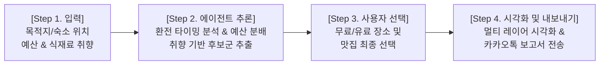
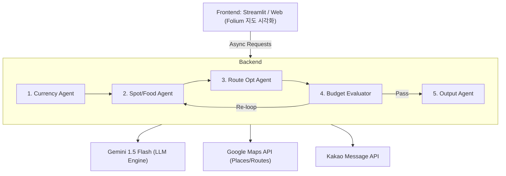

# [아이디어 제안서] LLM Multi-Agent 기반 맞춤형 여행 동선 & 예산 오케스트레이터

## 1. 사업/기획 개요
* **서비스명**: Trip Orchestrator (가제: 환전부터 카톡 일정까지 한 번에 짜주는 AI 여행 가이드)
* **한 줄 정의**: 사용자의 [환전 예산, 세부 음식/장소 취향, 소요 시간] 제약 조건을 반영하여, Lang Graph 기반 Multi-Agent가 최적의 동선·관광지·맛집을 조합하고 구글맵 시각화 및 카카오톡 리포트까지 발송해 주는 올인원(All-in-one) 여행 오케스트레이션 서비스.
* **주요 타겟**:
  * 해외여행 시 환전 예산 안에서 효율적으로 동선을 짜고 싶은 여행자
  * 특정 식재료(닭/돼지/소)나 메뉴(야키토리, 돈카츠 등) 취향이 확고한 자유여행객
  * 여러 여행 앱(지도, 가계부, 환율)을 왔다 갔다 하며 일정 짜기 번거로운 유저

---

## 2. 추진 배경 및 문제 정의 (Pain Points)
1. **파편화된 여행 서비스의 불편함** 
   현재 유저는 여행을 준비할 때 '환율/환전 앱', '동선/지도 앱', '맛집 블로그', '여행 가계부 앱'을 각각 별도로 사용하며 대조해야 합니다.
2. **현지 예산과 동선의 불일치** 
   기존 AI 일정 추천 서비스는 사용자의 '실제 환전 예산'을 반영하지 못합니다. 추천받은 유명 맛집이나 관광지를 가다 보면 예산을 크게 초과하거나, 거꾸로 가성비 동선을 짜느라 동선이 꼬이는 현상이 발생합니다.
3. **세밀한 개인 취향 반영의 한계** 
   "도쿄 일식 추천해줘" 수준의 거친 추천을 넘어, *"돼지고기 차슈가 들어간 라멘"*이나 "현지인 스타일의 닭고기 야키토리" 같은 식재료/분위기 레벨의 디테일한 필터링이 부족합니다.

---

## 3. 핵심 기능 및 UX 흐름 (Core Features)

### ① 실시간 환율 지표 분석 & 환전 타이밍 추천
* **통계 기반 지표 분석**: 과거 90일간의 환율 데이터를 바탕으로 $Z\text{-score}$ 및 상대강도지수(RSI)를 산출합니다.
* **스마트 환전 리포트**: 단순히 현재 환율을 보여주는 것을 넘어 *"최근 3개월 대비 4.2% 저렴한 구간으로, 80% 이상 일괄 환전 추천"*과 같은 구체적인 가이드를 제공합니다.

### ② 세분화된 취향 파싱 (식재료 & 메뉴 & 공간 특성)
* **LLM Semantic Parsing**: 사용자가 *"돼지고기 위주, 야키토리"*라고 입력하면, LLM이 이를 구글 Places API 쿼리 파라미터(`type`, `keyword`, `price_level`)로 정교하게 변환합니다.
* **관광지 속성 분류**: 실내/실외, 쇼핑/유적지/자연, 유료(입장료 금액 및 예매 링크 제공) / 무료 속성을 자동 태깅합니다.

### ③ 환전 예산 슬롯팅 & 자동 피드백 루프 (Budget Guard)
* **가격대(Price Level) 연동**: 구글 Places의 `price_level` 데이터와 입장료를 계산하여 한 끼당/일자별 예산 슬롯을 할당합니다.
* **예산 초과 시 자동 재조정**: 전체 일정 총액이 환전 예산을 초과할 경우, LangGraph 피드백 노드가 작동하여 유료 관광지를 무료 장소로 교체하거나 가성비 맛집으로 자동 재구성합니다.

### ④ 구글맵(Google Maps) 3단계 멀티 시각화
* **[In-App 시각화]**: 앱 화면(Streamlit) 지도 위에 방문 순서별 숫자 마커(1, 2, 3...)와 일자별 이동선(Polyline)을 시각적으로 렌더링.
* **[My Maps 내보내기]**: 생성된 일정을 KML/CSV 파일로 제공하여, 사용자의 구글 계정 '내 지도(Google My Maps)'에 오프라인 레이어로 저장 가능.
* **[Deep Link 길안내]**: 버튼 클릭 시 구글맵 앱이 즉시 실행되며, 경유지가 포함된 실시간 대중교통/차량 길안내 경로선이 자동으로 그려짐.

### ⑤ 카카오톡 나에게 보내기 API 기반 '여행 보고서' 발송
* 앱을 계속 켜둘 필요 없이, 일자별 동선, 예상 가계부 명세서, 구글맵 길안내 링크가 담긴 깔끔한 카카오톡 리포트 카드를 유저 휴대폰으로 직접 전송합니다.

---

## 4. 시스템 아키텍처 및 LangGraph 에이전트 설계

### 4.1 시스템 구성도

### 4.2 LangGraph Multi-Agent 역할 정의
1. **Currency Agent**: `yfinance` 기반 환율 지표 산출 -> 현지 통화 가용 예산 확정
2. **Spot & Food Agent**: 사용자 취향(식재료, 메뉴, 실내/외)을 파악하여 Places API 기반 후보 수집
3. **Route Optimizer Agent**: Google Routes Distance Matrix + OR-Tools 기반 이동 시간 최소화 경로 및 Polyline 좌표 세트 생성
4. **Budget Evaluator Agent (핵심 루프)**: $\text{총 예상 지출} \le \text{환전 예산}$ 검증. 초과 시 Spot Agent로 조정 명령 피드백
5. **Output & Notification Agent**: 구글맵 Deep Link 생성, KML 지도 파일 변환 및 카카오톡 메시지 API 호출

---

## 5. 카카오톡 리포트 연출 시나리오 (UI/UX)

> **[TripOrchestrator] AI 도쿄 맞춤 여행 리포트** 
> 🗓 **일정**: 2026.09.01~09.03 (2박 3일) 
> 💡 **환전 전략**: *"지금 환전하세요! (최근 3개월 평균 대비 4.2% 저렴)"* 
> 💰 **환전 예산**: 50,000엔 (예상 지출: 43,500엔 / 비상금: 6,500엔) 
>  
> **[1일차: 시부야 & 취향 맞춤 맛집 코스]** 
> • 14:00 - 숙소 체크인 (시부야 스트림 에셀 호텔) 
> • 15:30 - 메이지 신궁 (무료 / 산책) 
> • 18:00 - [맛집] 멘야 무사시 (돼지고기 차슈 라멘 / ~1,500엔) 
> • 20:00 - [취향] 야키토리 토리요시 (닭고기 꼬치구이 / ~3,500엔) 
>  
> 📍 [1일차 구글맵 실시간 경로선 & 길안내 열기](https://www.google.com/maps) 
> 📂 [구글 '내 지도 저장용 KML 파일 다운로드'](http://triporchestrator.com) 
> *유료 관광지 예매 링크 및 세부 가계부는 아래 버튼을 클릭하세요.*

---

## 6. 기술적/사업적 차별성 (Selling Points)

| 구분 | 기존 여행 앱 (트리플, Wanderlog 등) | TripOrchestrator (본 제안) |
| :--- | :--- | :--- |
| **예산 반영** | 일정을 짜준 후 가계부에 '기록'하는 방식 | '환전 예산'을 한계 조건으로 설정하여 AI가 역산으로 장소 추천 |
| **취향 정밀도** | "일식", "카페" 수준의 단순 카테고리 | 식재료(닭/돼지/소), 메뉴, 유료/무료, 실내/외 정밀 파싱 |
| **환율 연동** | 단순 환율 계산기 기능만 제공 | 통계 지표 기반 환전 타이밍 및 현지 예산 자동 산출 |
| **지도 시각화** | 핀만 찍어주거나 텍스트로 표기 | 앱 내 선 그리기 + 내 지도(My Maps) KML 내보내기 + 구글맵 실시간 길안내 연동 |
| **사용자 편의** | 앱 내부에서만 일정 확인 가능 | 카카오톡 메시지 카드 리포트로 일괄 전송 |

---

## 7. 개발 로드맵 및 무료 API 활용 계획

### 7.1 비용 0원(Free Tier) API 활용 전략
* **LLM Engine**: Google AI Studio (Gemini 1.5 Flash - 무료 개발 티어)
* **지도/동선/시각화**: Google Maps Platform (신규 가입 $300 크레딧 + 매월 기본 무료 제공량) 및 `streamlit-folium` (무료 Open Source)
* **환율 데이터**: `yfinance` (Python 라이브러리, 100% 무료)
* **메시징**: Kakao Developers '나에게 보내기 API' (무료)

### 7.2 개발 단계 (4주 플랜)
1. **1주차**: API Key 수집, `yfinance` 환율 분석 및 Google Places API 연동 모듈 개발
2. **2주차**: LangGraph State 정의 및 Multi-Agent (Currency, Spot, Route, Budget) 노드 구축
3. **3주차**: 예산 검증 피드백 루프 완성, OR-Tools 동선 최적화 및 Folium/KML 구글맵 시각화 모듈 구현
4. **4주차**: Streamlit UI 구성, 카카오톡 API 연동 테스트 및 공모전 시연 준비
